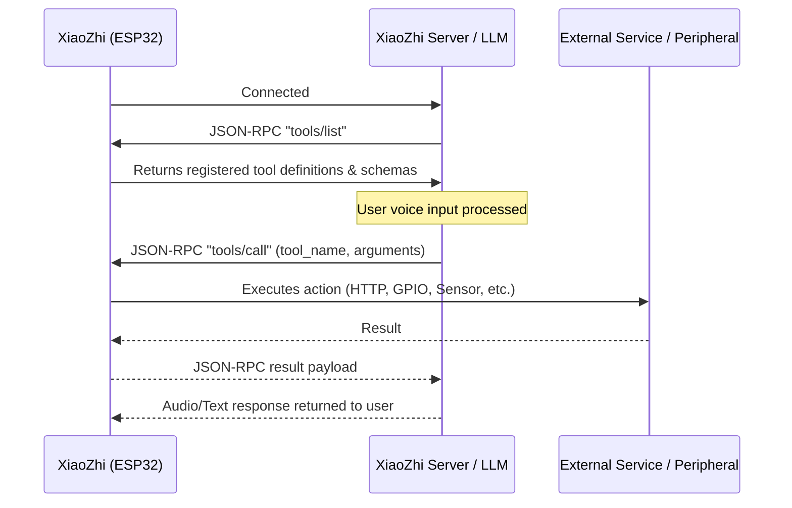

# Custom Tool Guide

This guide explains how to create, build, and register custom MCP (Model Context Protocol) tools for the XiaoZhi voice assistant firmware.

---

## Overview

XiaoZhi utilizes the **Model Context Protocol (MCP)** over WebSocket or MQTT to expose tools to the backend LLM (Large Language Model).



When a tool is registered on the device:

1. The backend discovers it via `tools/list` along with its parameter schema and natural language description.
2. When the user asks a relevant question or request, the LLM generates a `tools/call` JSON-RPC request.
3. The device executes the tool callback and sends the result back to the LLM to formulate the final answer.

---

## File Roles: `.h` vs `.cc`

In XiaoZhi's C++ architecture, tools are split into header (`.h`) and source (`.cc`) files:

| File Type          | Role                        | What Goes Inside                                                                                                                                                      |
| ------------------ | --------------------------- | --------------------------------------------------------------------------------------------------------------------------------------------------------------------- |
| **Header (`.h`)**  | **Public Interface**        | Declares the registration function (`Register<Name>Tool(McpServer& server)`). Exposes the tool to the rest of the application without leaking implementation details. |
| **Source (`.cc`)** | **Implementation & Schema** | Defines the tool name, description, arguments (`PropertyList`), and the execution callback lambda that carries out the logic.                                         |

---

## Managing API Keys and Secrets (`secrets.h`)

To prevent committing sensitive API keys, tokens, and credentials to Git, the project uses a git-ignored `secrets.h` header file.

### 1. Structure

- **`main/tools/secrets.h.example`** (Committed to Git): A template showing the required macro definitions.

  ```cpp
  #pragma once

  #define FIRECRAWL_API_KEY     "YOUR_FIRECRAWL_API_KEY"
  #define EMAIL_SERVICE_API_KEY "YOUR_EMAIL_API_KEY"
  #define OPENWEATHER_API_KEY   "YOUR_OPENWEATHER_API_KEY"
  ```

- **`main/tools/secrets.h`** (Ignored by `.gitignore`): Your local file containing the actual secret keys.

### 2. Setup

Copy the example file to `secrets.h` and add your real keys:

```bash
cp main/tools/secrets.h.example main/tools/secrets.h
```

`main/tools/secrets.h` is already listed in `.gitignore` to protect against accidental commits.

### 3. Usage in Tools

In your tool `.cc` file, check for and include `secrets.h`:

```cpp
#if __has_include("secrets.h")
#include "secrets.h"
#endif

#ifndef FIRECRAWL_API_KEY
#define FIRECRAWL_API_KEY ""
#endif
```

---

## Tool Placement

Depending on the scope of your tool:

- **Global / Service Tools** (e.g., Weather, Web Search, Email): Place in `main/tools/`.
- **Hardware-specific Tools** (e.g., Robot servos, IR transmitters, specific sensors): Place in `main/boards/<board-name>/` or `main/boards/common/`.

---

## Step-by-Step Guide

### Step 1: Create the Header File (`main/tools/my_tool.h`)

Declare the registration function and include `mcp_server.h`:

```cpp
#pragma once

#include "mcp_server.h"

// Registers the custom tool with the given McpServer instance
void RegisterMyTool(McpServer& server);
```

---

### Step 2: Create the Source File (`main/tools/my_tool.cc`)

Implement the registration function and tool logic:

```cpp
#include "my_tool.h"
#include <esp_log.h>
#include <cJSON.h>
#include <string>
#include "board.h"

// Include API secrets
#if __has_include("secrets.h")
#include "secrets.h"
#endif

#ifndef MY_SERVICE_API_KEY
#define MY_SERVICE_API_KEY ""
#endif

static const char* TAG = "MyTool";

void RegisterMyTool(McpServer& server) {
    ESP_LOGI(TAG, "Registering MCP tool: my_tool.action");

    server.AddTool(
        // 1. Tool Name (unique identifier, e.g. domain.action)
        "my_tool.action",

        // 2. Natural language description (guides the LLM on when and how to call it)
        "Perform a custom action. Args: query (string, required), count (integer, optional, 1-10)",

        // 3. Property List / Input Schema
        PropertyList({
            Property("query", kPropertyTypeString),                     // Required string
            Property("count", kPropertyTypeInteger, 1, 1, 10),          // Optional integer (default: 1, min: 1, max: 10)
            Property("mode", kPropertyTypeString, std::string("fast"))  // Optional string with default
        }),

        // 4. Callback execution lambda
        [](const PropertyList& properties) -> ReturnValue {
            // Extract arguments
            auto query = properties["query"].value<std::string>();
            int count = properties["count"].value<int>();
            auto mode = properties["mode"].value<std::string>();

            // Validate inputs
            if (query.empty()) {
                throw std::runtime_error("query parameter cannot be empty");
            }

            std::string api_key = MY_SERVICE_API_KEY;
            if (api_key.empty()) {
                throw std::runtime_error("MY_SERVICE_API_KEY is not configured in secrets.h");
            }

            ESP_LOGI(TAG, "Invoked with query='%s', count=%d, mode='%s'",
                     query.c_str(), count, mode.c_str());

            // Example: Make an HTTP request via the board network stack
            auto& board = Board::GetInstance();
            auto http = board.GetNetwork()->CreateHttp(5000); // 5-second timeout
            http->SetHeader("Authorization", ("Bearer " + api_key).c_str());

            // Return types can be: std::string, bool, int, cJSON*, or ImageContent*
            return std::string("Success: Action executed for query " + query);
        }
    );
}
```

---

### Step 3: Add to `main/CMakeLists.txt`

For the build system to compile your new tool:

1. Add `"tools"` to `INCLUDE_DIRS`:

   ```cmake
   set(INCLUDE_DIRS "." "tools" "display" "display/lvgl_display" "display/lvgl_display/jpg" "audio" "audio/demuxer" "protocols")
   ```

2. Add your `.cc` file to `SOURCES`:
   ```cmake
   set(SOURCES "audio/audio_codec.cc"
               ...
               "tools/my_tool.cc"
               "main.cc"
               )
   ```

---

### Step 4: Register the Tool in Application Lifecycle

#### Option A: Register Globally (All Boards)

Open `main/application.cc`:

1. Include your header:
   ```cpp
   #include "my_tool.h"
   ```
2. In `Application::Start()` (around lines 102–105), register your tool:

   ```cpp
   auto& mcp_server = McpServer::GetInstance();
   mcp_server.AddCommonTools();
   mcp_server.AddUserOnlyTools();

   // Register your custom tool
   RegisterMyTool(mcp_server);
   ```

#### Option B: Register for a Specific Board Only

Open your board file (e.g. `main/boards/my-board/my_board.cc`):

1. In `InitializeTools()`:
   ```cpp
   void InitializeTools() {
       auto& mcp_server = McpServer::GetInstance();
       RegisterMyTool(mcp_server);
   }
   ```

---

## Tool API Reference

### Parameter Types (`PropertyType`)

| Type                           | Enum                   | Definition Syntax                                                       |
| ------------------------------ | ---------------------- | ----------------------------------------------------------------------- |
| **Required String**            | `kPropertyTypeString`  | `Property("name", kPropertyTypeString)`                                 |
| **Optional String**            | `kPropertyTypeString`  | `Property("name", kPropertyTypeString, std::string("default_value"))`   |
| **Required Integer (Bounded)** | `kPropertyTypeInteger` | `Property("name", kPropertyTypeInteger, min_val, max_val)`              |
| **Optional Integer (Bounded)** | `kPropertyTypeInteger` | `Property("name", kPropertyTypeInteger, default_val, min_val, max_val)` |
| **Required Boolean**           | `kPropertyTypeBoolean` | `Property("name", kPropertyTypeBoolean)`                                |
| **Optional Boolean**           | `kPropertyTypeBoolean` | `Property("name", kPropertyTypeBoolean, true)`                          |

### Return Value Types (`ReturnValue`)

The callback function must return a `ReturnValue` (`std::variant`):

- `std::string`: Plain text or formatted string response sent to LLM.
- `bool`: `true` or `false` indicating success or failure.
- `int`: Numerical return value.
- `cJSON*`: Structured JSON object (ownership is handled by the server).
- `ImageContent*`: Base64-encoded image payload (e.g., camera capture).

### Public vs User-Only Tools

- **`McpServer::AddTool(...)`**: Standard tool. Visible to LLM in `tools/list` and autonomously invoked during conversation.
- **`McpServer::AddUserOnlyTool(...)`**: Hidden tool annotated with `"audience": ["user"]`. Only returned when backend requests `withUserTools=true`. Intended for privileged/manual actions (reboot, OTA firmware upgrade, manual configuration) that the LLM should not trigger autonomously.

---

## Common Patterns

### 1. Authenticated HTTP API Request (REST / JSON)

```cpp
auto& board = Board::GetInstance();
auto http = board.GetNetwork()->CreateHttp(8000); // 8s timeout

http->SetHeader("Content-Type", "application/json");
http->SetHeader("Authorization", ("Bearer " + std::string(FIRECRAWL_API_KEY)).c_str());

std::string response_body;
int status_code = http->Post("https://api.example.com/v1/action", payload_json_str, response_body);

if (status_code != 200) {
    throw std::runtime_error("API request failed with status " + std::to_string(status_code));
}

// Parse response JSON if needed
cJSON* root = cJSON_Parse(response_body.c_str());
// ... process JSON ...
cJSON_Delete(root);

return response_body;
```

### 2. Error Handling

Throw a `std::runtime_error` when input parameters are invalid or network/hardware operations fail. The MCP server catches exceptions and formats an error response back to the LLM:

```cpp
if (temperature < -50 || temperature > 60) {
    throw std::runtime_error("Temperature out of valid range (-50 to 60 C)");
}
```

---

## Building and Verification

1. Build the firmware for your board:

   ```bash
   python3 scripts/build.py <board-directory> --name <variant-name>
   ```

2. Flash and monitor output:

   ```bash
   idf.py flash monitor
   ```

3. Watch for tool registration in logs:

   ```text
   I (1234) MyTool: Registering MCP tool: my_tool.action
   ```

4. Interact with XiaoZhi using voice prompts matching your tool's description to verify execution.
